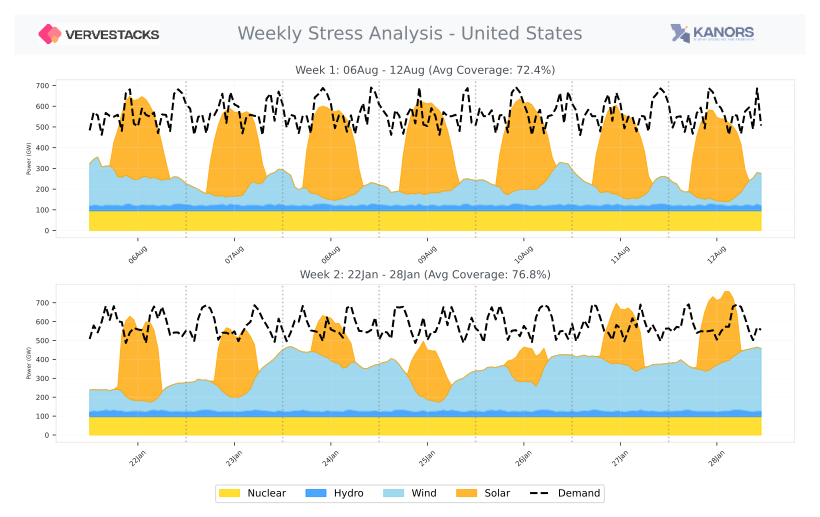

=====================================
Stress-Based Timeslice Design
=====================================

**Intelligent temporal modeling through operational stress identification**

VerveStacks transforms the 8760-hour modeling challenge into intelligent timeslice structures by identifying periods of maximum operational stress in high-renewable energy systems. **Each ISO receives its own unique timeslice definition**, tailored to that country's specific demand patterns, renewable resource characteristics, and operational challenges. Rather than using fixed temporal patterns, we construct hypothetical "clean" energy scenarios for each ISO and analyze when storage, ramping, and dispatchable resources face their greatest challenges.

.. list-table::
   :class: borderless
   :widths: 50 50

   * - .. figure:: ../_static/images/case-studies/re_analysis_summary_ESP.svg
          :alt: Spain coverage analysis
          :width: 90%
          
          Spain: Mediterranean solar patterns

     - .. figure:: ../_static/images/case-studies/re_analysis_summary_BRA.svg
          :alt: Brazil coverage analysis  
          :width: 90%
          
          Brazil: Tropical hydro-wind diversity

   * - .. figure:: ../_static/images/case-studies/stress_periods_s5p5v5_d_ESP.svg
          :alt: Spain stress periods
          :width: 90%
          
          Spain: Solar-driven daily peaks

     - .. figure:: ../_static/images/case-studies/stress_periods_s5p5v5_d_BRA.svg
          :alt: Brazil stress periods
          :width: 90%
          
          Brazil: Seasonal hydro variations

Methodology Overview
====================

The stress-based approach follows a systematic four-stage process **applied individually to each ISO**:

1. **National Shape Aggregation**: Transform grid-cell renewable profiles into realistic national patterns
2. **Clean Supply Construction**: Build hypothetical zero-emission supply scenarios using existing assets plus renewables
3. **Stress Period Identification**: Analyze supply-demand mismatches to rank operational challenges
4. **Intelligent Aggregation**: Select critical periods for hourly modeling, cluster the remainder

.. epigraph::

   **Every ISO gets its own analysis**: A country with abundant hydro will have different stress periods than one dominated by solar potential. Arctic countries face different seasonal challenges than tropical ones. The methodology adapts to each country's unique energy landscape.

The goal is not energy balance, but **stress identification**—finding the days and weeks that will test each country's grid flexibility most severely.

Stage 1: National Renewable Shape Aggregation
==============================================

**From Grid Cells to National Patterns (Per ISO)**

Individual renewable energy grid cells often exhibit unrealistic characteristics—including complete zero-generation periods that would never occur in diversified national portfolios. **For each ISO separately**, we address this through economic aggregation:

**Demand-Constrained Selection**
   Using actual national electricity generation as the target, we select only the most cost-effective grid cells rather than theoretical maximum potential.

**Economic Ranking**
   Grid cells are sorted by levelized cost of energy (LCOE), ensuring deployment follows economic logic rather than resource abundance alone.

**Spatial Portfolio Effect**
   Capacity-weighted averaging across selected grid cells eliminates unrealistic zero-generation periods while preserving temporal variability needed for stress analysis.

**Result**: Realistic national renewable profiles that reflect actual deployment economics and geographic diversity, suitable for operational stress analysis.

Stage 2: Clean Supply Construction
===================================

**Building the Hypothetical Zero-Emission Scenario (Per ISO)**

**For each country individually**, we construct a complete 8760-hour "clean" electricity supply using a systematic approach:

**Baseline Generation Foundation**
   - **Nuclear**: Existing capacity operating as flat baseload throughout the year
   - **Hydro**: Existing capacity shaped to follow monthly supply patterns from EMBER data - shaped to follow demand patterns within each month

**Renewable Gap-Filling**
   - Calculate residual electricity demand after accounting for nuclear and hydro
   - Fill this residual with solar and wind capacity using economic logic and realistic technology shares
   - Apply national renewable shapes derived from grid-cell aggregation

**Technology Portfolio Logic**
   Solar and wind shares are determined through enhanced LCOE calculations combined with historical deployment patterns, preventing unrealistic technology monopolization while maintaining cost-effectiveness.

**Result**: Complete 8760-hour supply profile representing a realistic zero-emission electricity system for stress testing.

Stage 3: Stress Period Identification
======================================

**Coverage Analysis Framework**

The heart of the methodology lies in **coverage analysis**—comparing clean supply to electricity demand hour by hour:

.. epigraph::

   **Coverage Ratio** = (Clean Generation) / (Electricity Demand) × 100%

**Three Stress Categories**

**Scarcity Periods (Coverage < 100%)**
   Hours when clean generation falls short of demand, requiring storage discharge, imports, or dispatchable backup. These periods test the adequacy of storage capacity and flexible resources.

**Surplus Periods (Coverage > 100%)**
   Hours when clean generation exceeds demand, requiring storage charging, exports, or curtailment. These periods test grid absorption capacity and storage charging infrastructure.

**Volatile Periods (High Coverage Variability)**
   Hours with rapid coverage changes, requiring maximum ramping capability and operational flexibility. These periods test the speed and agility of grid response systems.

**Operational Stress Ranking**

Days and weeks are ranked independently within each category:
   - **Scarcity ranking**: Days with lowest average coverage (most severe shortfalls)
   - **Surplus ranking**: Days with highest average coverage (most severe oversupply)  
   - **Volatility ranking**: Days with highest coverage variability (most operational challenges)

**Result**: Three ranked lists identifying the most operationally challenging periods in each stress category.

Stage 4: Intelligent Temporal Aggregation
==========================================

**Configurable Critical Period Selection**

From the ranked stress lists, we select varying numbers of days and weeks for explicit hourly modeling:

**Daily Stress Configurations**
   - Select top-ranked days from each category (e.g., 3 scarcity + 3 surplus + 3 volatility days)
   - Each selected day retains full 24-hour resolution for detailed operational analysis

**Weekly Stress Configurations**  
   - Select sustained stress weeks for extended storage and ramping analysis
   - Capture multi-day operational challenges that daily analysis might miss

**Day-Based Seasonal Clustering**
   Unlike traditional month-based aggregation, VerveStacks clusters all 365 days directly into seasons based on their net load patterns. This approach captures multi-day events (such as wind droughts or sustained low-solar periods) that may span across month boundaries. 
   
   The clustering algorithm:
   
   - Analyzes each day's net load profile (mean, peak, minimum, variability, daytime/evening patterns)
   - Groups days with similar characteristics into contiguous seasons
   - Enforces a minimum days-per-season threshold (default: 5 days) to prevent fragmented single-day seasons
   - Preserves temporal continuity so adjacent days remain in the same cluster when patterns are similar
   
   This day-level granularity is essential for capturing the operational reality of battery storage systems that operate on daily charge/discharge cycles, and for identifying sustained renewable droughts that stress system flexibility over multiple consecutive days.

**Adaptive Timeslice Assembly (ISO-Specific)**
   The final timeslice structure combines:
   - High-resolution critical periods (hourly detail where it matters most)
   - Day-clustered seasons (365 days grouped into 4-12 seasons based on net load similarity)
   - Hour-clustered periods (24 hours grouped into 3-8 diurnal periods)
   - Proper weighting to preserve annual energy balance
   
   **Each ISO receives its own complete timeslice definition**—including both the stress periods and the day-based aggregated clusters. Germany's winter scarcity periods will differ completely from Brazil's dry season challenges or Japan's summer peak stress.

Validation and Visualization
=============================

**Stress Period Representativeness**
   Selected periods are validated to ensure they capture the full spectrum of operational challenges, from sustained shortfalls to rapid ramping events.

**Energy Balance Preservation**
   Despite focusing on stress periods, the complete timeslice structure maintains annual energy conservation and realistic operational constraints.

**Visual Diagnostics**
   Coverage analysis produces intuitive visualizations showing when and how severely the electricity system will be stressed, enabling stakeholders to understand operational challenges at a glance.

Methodology in Action: USA Case Study
=====================================

The following visualizations demonstrate the stress-based methodology applied to the United States, showing how coverage analysis identifies critical operational periods.

**Coverage Analysis Overview**

   **Coverage Metric Demonstration**: This chart shows the complete coverage analysis for the USA, illustrating how clean generation (nuclear + hydro + renewables) compares to electricity demand throughout the year. The coverage ratio reveals when the system faces scarcity (red zones below 100%) and surplus (green zones above 100%).

**Daily Stress Period Selection**

   **Top 5 Days from Each Stress Category**: This visualization shows the selected critical days—5 scarcity days (lowest coverage), 5 surplus days (highest coverage), and 5 volatility days (highest variability). Each selected day receives full hourly resolution in the final timeslice structure.

**Weekly Stress Analysis**

   **Prolonged Shortage Periods**: Extended stress weeks capture sustained operational challenges that daily analysis might miss. These multi-day periods test storage capacity and sustained generation capability over longer timeframes.

**Day-Based Seasonal Clustering**

.. figure:: ../_static/images/case-studies/aggregation_justification_USA_ts_096.svg
   :alt: USA day-based seasonal clustering
   :align: center
   :width: 100%

   **365 Days Clustered into Seasons**: This visualization shows how the USA's 365 days are grouped into seasons based on net load similarity, with a calendar heatmap revealing the temporal distribution. The day-based clustering captures multi-day wind droughts and sustained low-solar periods that month-based approaches would miss. Rolling averages show how net load patterns evolve through the year, with distinct seasonal bands emerging from the clustering algorithm.

Contrasting Energy Landscapes: China Case Study
===============================================

China presents a dramatically different energy landscape, demonstrating how the stress-based methodology adapts to diverse national characteristics. Where the USA shows moderate seasonal variation, China exhibits extreme contrasts between renewable abundance and scarcity periods.

**China's Coverage Analysis**

   **Extreme Seasonal Contrasts**: China's coverage analysis reveals much sharper seasonal patterns than the USA. The massive scale of China's energy system creates distinct periods of extreme surplus (potentially over 200% coverage) and severe scarcity, reflecting the country's vast renewable resources and enormous electricity demand.

**China's Daily Stress Periods**

   **Continental-Scale Stress Patterns**: China's selected stress days show the complexity of managing a continental-scale energy system. The surplus periods demonstrate the potential for massive renewable generation, while scarcity periods highlight the challenge of meeting enormous industrial and urban demand during low renewable periods.

**China's Weekly Stress Analysis**

   **Sustained Stress at Scale**: China's weekly stress periods reveal the magnitude of sustained operational challenges in the world's largest energy system. These extended periods test not just storage and ramping capability, but the coordination of resources across vast geographic distances.

**China's Day-Based Seasonal Clustering**

.. figure:: ../_static/images/case-studies/aggregation_justification_CHN_ts_096.svg
   :alt: China day-based seasonal clustering
   :align: center
   :width: 100%

   **Continental-Scale Day Clustering**: China's 365 days are grouped into seasons reflecting the country's vast geographic and climatic diversity. The calendar heatmap reveals how seasonal boundaries emerge from actual net load patterns rather than arbitrary calendar months. By clustering days directly, the system captures China's unique multi-day weather events, industrial demand cycles, and the interplay between northern heating demand and southern cooling loads.

Key Contrasts: USA vs China
============================

The comparison between USA and China stress periods illustrates the methodology's adaptability:

**Scale Differences**
   - **USA**: Moderate seasonal variation, balanced renewable mix, regional diversity
   - **China**: Extreme seasonal contrasts, massive scale effects, continental coordination challenges

**Stress Period Characteristics**
   - **USA**: Gradual transitions, moderate surplus/scarcity ranges
   - **China**: Sharp seasonal breaks, extreme surplus potential, severe scarcity periods

**Operational Implications**
   - **USA**: Focus on regional balancing, moderate storage requirements
   - **China**: Continental-scale coordination, massive storage and transmission needs

This demonstrates why **every ISO requires its own unique timeslice definition**—no universal template could capture both the USA's moderate seasonal patterns and China's extreme continental-scale energy dynamics.

The day-based clustering approach is particularly valuable here: a wind drought spanning late January through early February would be split across two months in traditional aggregation, but is captured as a single coherent stress event when clustering 365 days directly. This granularity matters most for countries with pronounced multi-day weather patterns that don't align with calendar boundaries.
